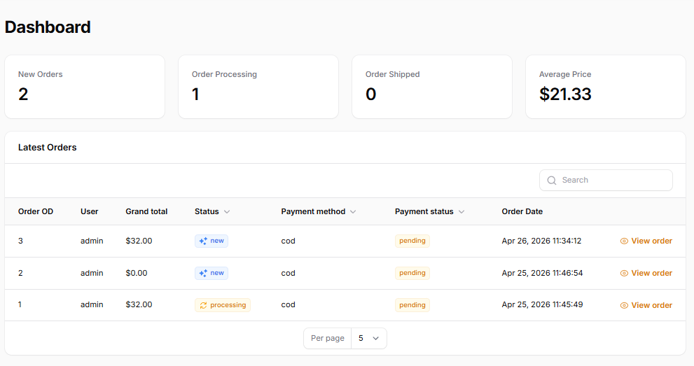
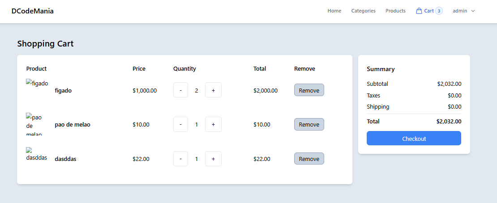
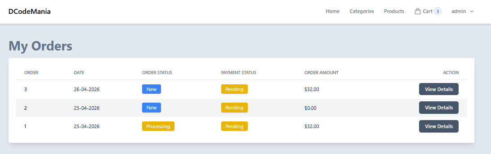
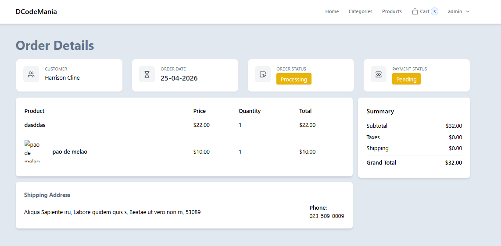
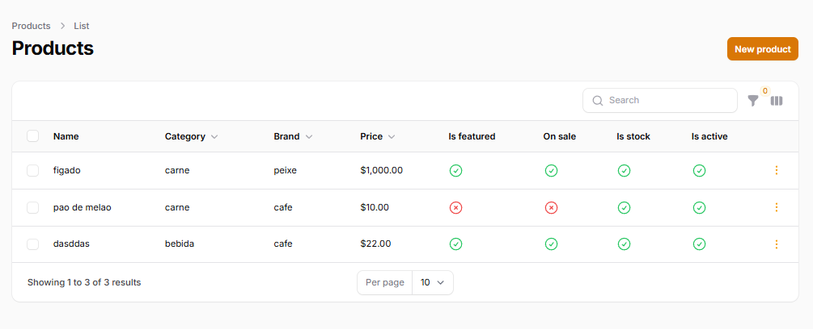

# 🛒 E-commerce Laravel (Projeto de Estudo)

Projeto de e-commerce desenvolvido para fins de estudo utilizando **Laravel**, **Livewire** e **Filament**.
O sistema simula funcionalidades reais de uma loja online, incluindo listagem de produtos, carrinho e checkout.

---

## Tecnologias utilizadas

* PHP (Laravel)
* Filament (Painel administrativo)
* Livewire
* MySQL
* Tailwind CSS
* JavaScript

---

## Funcionalidades

* Listagem de produtos
* Filtro por categoria e marca
* Carrinho de compras
* Checkout
* Painel administrativo com Filament
* Gerenciamento de pedidos
* Sistema de autenticação

---

## Observações

Este projeto foi desenvolvido com base em uma série de estudos do YouTube e posteriormente ajustado e corrigido, incluindo:

* Correções de erros em versões mais recentes do PHP (8.4)
* Tratamento de produtos sem imagem
* Ajustes no carrinho de compras
* Configuração manual do ambiente e banco de dados

---

## Como rodar o projeto

### 1. Clonar o repositório

```
git clone https://github.com/seu-usuario/seu-repositorio.git
```

### 2. Acessar a pasta

```
cd nome-do-projeto
```

### 3. Instalar dependências do PHP

```
composer install
```

### 4. Criar o arquivo .env

```
copy .env.example .env
```

### 5. Gerar chave da aplicação

```
php artisan key:generate
```

### 6. Configurar banco de dados

No arquivo `.env`, configure:

```
DB_DATABASE=laravel
DB_USERNAME=root
DB_PASSWORD=
```

### 7. Rodar migrations

```
php artisan migrate
```

### 8. Instalar dependências do frontend

```
npm install
```

### 9. Rodar o projeto

```
php artisan serve
```

### 10. Rodar o frontend (opcional)

```
npm run dev
```

---

## Acesso ao sistema

### Painel administrativo (Filament)

```
http://127.0.0.1:8000/admin
```

Email:

```
admin@gmail.com
```

Senha:

> Definida no momento da criação do usuário com `php artisan make:filament-user`

**Observação:**

O e-mail `admin@gmail.com` foi definido no projeto como padrão para acesso ao painel administrativo (Filament).
Isso ocorre porque existe uma regra no modelo de usuário (`canAccessPanel`) que controla quem pode acessar o painel.

Esse comportamento pode ser alterado facilmente no código para permitir outros usuários.

---

## Configuração de e-mail

Para evitar erros no envio de e-mail durante testes, configure no `.env`:

```
MAIL_MAILER=log
```

---

## Observação sobre imagens

O sistema permite produtos sem imagem.
Foram feitas validações para evitar erros ao exibir ou adicionar ao carrinho.

---

## Status do projeto

Projeto em desenvolvimento
Algumas funcionalidades ainda podem ser melhoradas ou expandidas.

---

## 📷 Screenshots

### 🖥️ Dashboard (Admin)


### 🛒 Carrinho


### 📦 Meus Pedidos


### 📄 Detalhes do Pedido


### ⚙️ Gerenciamento de Produtos (Admin)



---

## Fonte de estudo

Projeto baseado em uma série de vídeos do YouTube:

https://www.youtube.com/watch?v=0AaOFn-n6Ho&list=PL6u82dzQtlfv8fJF3gm42TDHJdtA2NDWT

---

## Autor

Desenvolvido por Isak Gabriel
